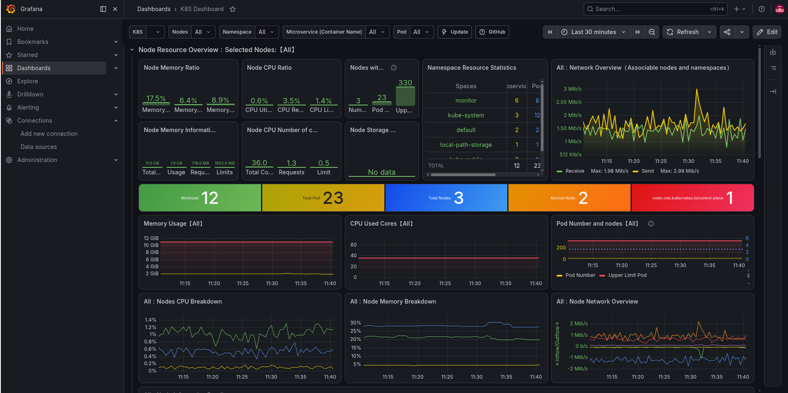

# System Monitoring with Grafana, Prometheus and Kubernetes(KIND)
## Pre-requisites
- Kind
- Helm
- Kubectl
- Cluster with project running locally in kind

## Installation of Prometheus and Grafana in Kind using helm

### install prometheus and Grafana in monitor namespace
```bash
helm repo add prometheus-community https://prometheus-community.github.io/helm-charts
helm repo update
kubectl create namespace monitor
kubectl apply -f kube-state-metrics.yaml -n monitor
helm install prometheus prometheus-community/kube-prometheus-stack -n monitor
```

- Port forwards
```bash
kubectl port-forward svc/prometheus-grafana 3000:80 -n monitor
kubectl port-forward svc/prometheus-kube-prometheus-prometheus 9090:9090 -n monitor
```

- login to grafana
http://localhost:3000

- Use `admin` as username
- Use the output of the below command as password

```bash
kubectl get secret -n monitor kind-prometheus-grafana -o jsonpath="{.data.admin-password}" | base64 -d
```
- After logging in to grafana, you can see the dashboard (You might import and load with dashboard id 16651)


